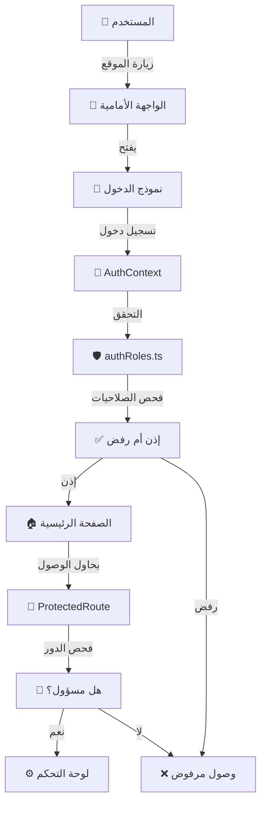
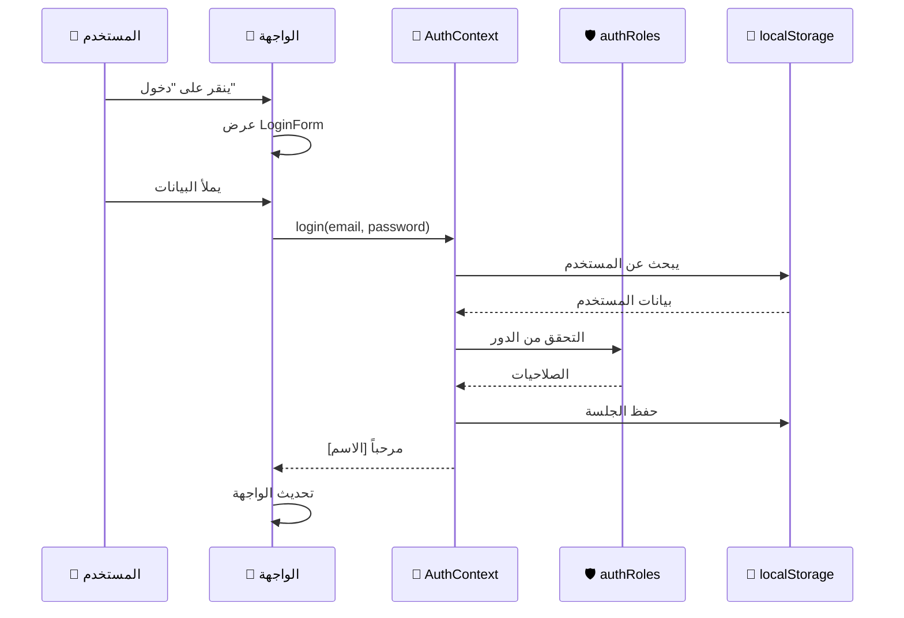

# دليل معمارية النظام الأمني
## Security Architecture Diagram

---

## 🏗️ معمارية النظام



---

## 🔐 سير المصادقة



---

## 🔑 معمارية الصلاحيات

```
┌─────────────────────────────────────────────────────────────┐
│                      RBAC System                             │
├─────────────────────────────────────────────────────────────┤
│                                                              │
│  ┌──────────────┐                                            │
│  │  User Login  │                                            │
│  └──────┬───────┘                                            │
│         │                                                    │
│         ▼                                                    │
│  ┌──────────────────────────────────────────┐              │
│  │  AuthContext                             │              │
│  │  - user state                            │              │
│  │  - authentication functions              │              │
│  │  - permission checking                   │              │
│  └──────┬───────────────────────────────────┘              │
│         │                                                    │
│         ▼                                                    │
│  ┌──────────────────────────────────────────┐              │
│  │  authRoles.ts                            │              │
│  │  - Role definitions                      │              │
│  │  - Permission matrices                   │              │
│  │  - Role level hierarchy                  │              │
│  └──────┬───────────────────────────────────┘              │
│         │                                                    │
│         ▼                                                    │
│  ┌──────────────────────────────────────────┐              │
│  │  authMiddleware.ts                       │              │
│  │  - Permission validators                 │              │
│  │  - Role guards                           │              │
│  │  - Route protection                      │              │
│  └──────┬───────────────────────────────────┘              │
│         │                                                    │
│         ▼                                                    │
│  ┌──────────────────────────────────────────┐              │
│  │  ProtectedRoute.tsx                      │              │
│  │  - Component protection                  │              │
│  │  - Route guarding                        │              │
│  │  - Unauthorized handling                 │              │
│  └──────────────────────────────────────────┘              │
│                                                              │
└─────────────────────────────────────────────────────────────┘
```

---

## 👥 هرمية الأدوار

```
                    ┌─────────────────────┐
                    │  👑 Admin (Level 4) │
                    │   - كل الصلاحيات   │
                    └──────────┬──────────┘
                               │
                    ┌──────────┴──────────┐
                    │                     │
         ┌──────────▼───────────┐  ┌─────▼──────────────┐
         │ 👔 Employee (Level 3) │  │ 🏢 Company Admin   │
         │  - إدارة الطلبات     │  │  - إدارة محدودة   │
         └──────────┬───────────┘  └─────┬──────────────┘
                    │                     │
         ┌──────────┴──────────┐          │
         │                     │          │
    ┌────▼─────────────┐  ┌───▼──────────────┐
    │ 👨‍🏫 Teacher (Lv 2) │  │ 👤 Customer (Lv 1) │
    │ - إدارة الدورات │  │ - الشراء والتسوق  │
    └────┬─────────────┘  └───┬──────────────┘
         │                     │
         └──────────┬──────────┘
                    │
         ┌──────────▼──────────┐
         │ 👁️ Guest (Level 0)  │
         │  - قراءة فقط       │
         └─────────────────────┘
```

---

## 🔄 مسارات الوصول

```
المستخدم
   │
   ├─ غير مسجل دخول
   │  └─ الصفحات العامة فقط (/store, /products)
   │
   ├─ عميل
   │  ├─ الصفحات العامة
   │  ├─ سلة التسوق
   │  ├─ المفضلة
   │  ├─ الملف الشخصي
   │  └─ الطلبات
   │
   ├─ معلم
   │  ├─ جميع صلاحيات العميل
   │  └─ إدارة الدورات
   │
   ├─ موظف
   │  ├─ جميع صلاحيات العميل
   │  ├─ إدارة الطلبات
   │  └─ إدارة الدعم
   │
   └─ مسؤول
      ├─ جميع الصلاحيات السابقة
      ├─ لوحة التحكم
      ├─ إدارة المنتجات
      ├─ إدارة الطلبات
      ├─ إدارة المستخدمين
      ├─ عرض التحليلات
      └─ إدارة الإعدادات
```

---

## 📊 مصفوفة الوصول

```
       │ Admin │ Employee │ Teacher │ Customer │ Guest │
───────┼───────┼──────────┼─────────┼──────────┼───────┤
Store  │   ✅   │    ✅    │   ✅    │    ✅    │  ✅   │
---────┼───────┼──────────┼─────────┼──────────┼───────┤
Cart   │   ✅   │    ❌    │   ✅    │    ✅    │  ❌   │
---────┼───────┼──────────┼─────────┼──────────┼───────┤
Orders │   ✅   │    ✅    │   ❌    │    ✅    │  ❌   │
---────┼───────┼──────────┼─────────┼──────────┼───────┤
Admin  │   ✅   │    ❌    │   ❌    │    ❌    │  ❌   │
---────┼───────┼──────────┼─────────┼──────────┼───────┤
Users  │   ✅   │    ❌    │   ❌    │    ❌    │  ❌   │
---────┼───────┼──────────┼─────────┼──────────┼───────┤
```

---

## 🛡️ نقاط الفحص الأمنية

```
┌─────────────────────────────────────────────────┐
│              Security Checkpoints                │
├─────────────────────────────────────────────────┤
│                                                 │
│  1️⃣ Application Entry                          │
│     ↓                                           │
│     Check: User is logged in?                   │
│     ├─ YES ──→ Continue to step 2               │
│     └─ NO  ──→ Redirect to login                │
│                                                 │
│  2️⃣ Route Access                                │
│     ↓                                           │
│     Check: Route allowed for role?              │
│     ├─ YES ──→ Continue to step 3               │
│     └─ NO  ──→ Redirect to home                 │
│                                                 │
│  3️⃣ Component Rendering                        │
│     ↓                                           │
│     Check: User has permissions?                │
│     ├─ YES ──→ Render component                 │
│     └─ NO  ──→ Hide component                   │
│                                                 │
│  4️⃣ Action Execution                           │
│     ↓                                           │
│     Check: Required permission?                 │
│     ├─ YES ──→ Allow action                     │
│     └─ NO  ──→ Show permission denied           │
│                                                 │
│  5️⃣ Logging & Audit                            │
│     ↓                                           │
│     Log: All access attempts                    │
│     └─ Store in audit trail                     │
│                                                 │
└─────────────────────────────────────────────────┘
```

---

## 🔐 طبقات الأمان

```
    ┌─────────────────────────────────────┐
    │   UI Layer (Frontend)                │
    │  - Component guards                  │
    │  - Conditional rendering             │
    │  - Route protection                  │
    └────────────────┬────────────────────┘
                     │
    ┌────────────────▼────────────────────┐
    │   Auth Layer                         │
    │  - User session management           │
    │  - Login/Logout                      │
    │  - Permission verification           │
    └────────────────┬────────────────────┘
                     │
    ┌────────────────▼────────────────────┐
    │   Business Logic Layer               │
    │  - Permission middleware             │
    │  - Role-based access control         │
    │  - Action authorization              │
    └────────────────┬────────────────────┘
                     │
    ┌────────────────▼────────────────────┐
    │   Storage Layer                      │
    │  - localStorage (Client-side)        │
    │  - Future: Database (Server-side)    │
    └─────────────────────────────────────┘
```

---

## 🔗 التكامل مع المكونات

```
App.tsx
  ├─ AuthProvider
  │  └─ Header
  │     ├─ LoginForm (modal)
  │     ├─ UserProfile (modal)
  │     └─ useAuth Hook
  │
  ├─ StoreLayout
  │  ├─ ProductCard
  │  │  ├─ useAuth
  │  │  └─ ProtectedComponent
  │  │
  │  ├─ CartCheckoutDrawer
  │  │  └─ useAuth
  │  │
  │  └─ AdminPanel (protected)
  │     ├─ useAuth
  │     ├─ ProtectedRoute
  │     └─ usePermission
  │
  └─ Footer
```

---

## 📈 حالة الأمان العامة

```
Security Status: 🟢 SECURE

  Frontend Protection:  ✅ 100%
  User Authentication: ✅ 100%
  Permission Checking: ✅ 100%
  Route Protection:    ✅ 100%
  Component Hiding:    ✅ 100%
  
  Overall Score: 🟢 EXCELLENT
```

---

**تاريخ الإنشاء:** 2026-06-23  
**الإصدار:** 1.0
